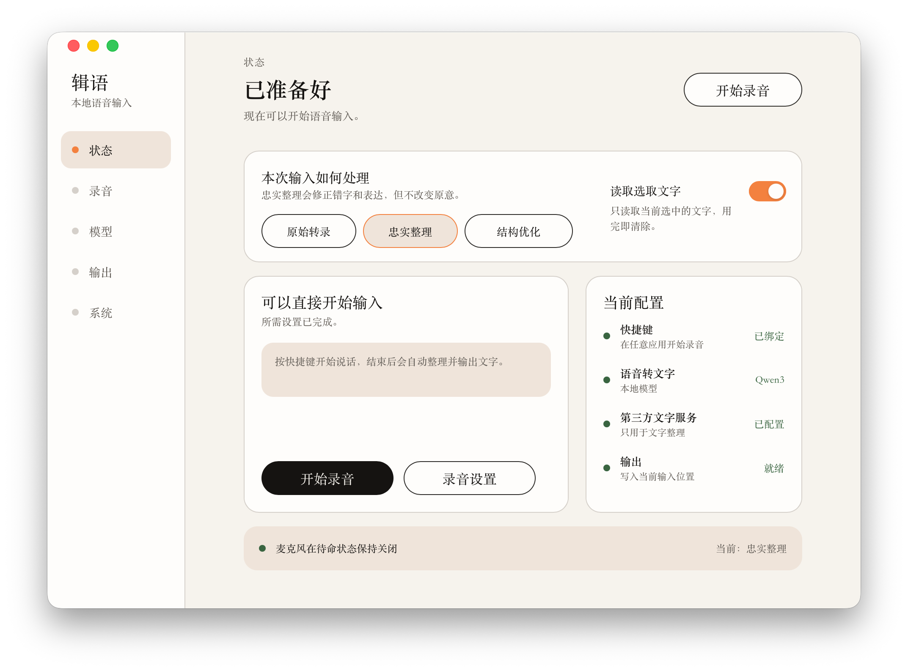

# 辑语 RemTene

[English](./README_EN.md)



> 用话语加速手指输入；在完全不改变您的原意的前提下，把具有缺陷的语音表述转成逻辑清晰，排版易读的干净文字。

```math
Rem tene, verba sequentur.
把握本意，言辞自来。
```
---

「辑语」是源码可用、跨应用、系统级的语音输入工具。音频在本地完成 ASR（自动语音识别）；用户可以选择将文字发送到自己配置的 OpenAI-Compatible（OpenAI 兼容）服务做忠实整理与结构优化，最后把整理好的文本到原来的输入位置。实际端到端耗时取决于本地 ASR、您配置的模型服务网关和模型输出速度。
不同于闭源软件字数限制和内购购买，您可以在此软件选择您自己的音频识别模型，以及自由的使用第三方ApiKey来使用。数据流向完全由您自己掌握。


## 产品功能

- **多语言**：当您在一句话里夹杂中文、英语。或使用法语德语等30 种语言和部分方言，本地模型均可以进行识别。
- **原始转录**：只使用本地语音模型进行识别，将您的原话一字不差的转成文字并插入到您指定的光标处。
- **忠实整理**：当您配置好第三方服务时，RemTene会将本地转换出的文字发送给您指定的模型提供商处，由LLM和RemTene共同保证为您整理的话语100%符合您的原意，同时修正所有人为表达缺陷和语音瑕疵。确保输出正确的事实、立场、条件、语气与逻辑关系。
- **选取文字**：您可以选择任何您可以选择的文字片段，把它作为上下文一起发送到LLM，这样您通过命令如，翻译、查询、创建回复等命令。LLM将根据你的命令来对选取的文字进行处理。
- **本地 ASR**：Qwen 与 Whisper 都在本地进行音频处理，这意味着，您的原始音频永远不会离开您的本机，并且每次处理后都将自动清除，不留任何录音痕迹。
- **控制面板**：您可以在控制面板里，设置快捷触发键、开机启动、或者查看您曾经的输出历史。

## 数据与隐私

- 音频不离开本地设备，也不进入 LLM、历史或诊断；
- 麦克风只在用户明确触发的录音期间开启；
- 原始转录完全本地；AI 模式只向用户配置的服务发送完成任务所需的文字和经授权的选区内容；
- 您所设置的 API Key 当前由 Rust 侧以 AES-256-GCM 进行本地字段级加密，主密钥与 SQLite 密文分开保存在应用私有目录；当前实现不是 macOS Keychain 或 Windows Credential Manager；
- 历史只保存最终文字和创建时间，可关闭后续保存；历史正文当前没有应用层加密；
- 日志、普通设置、快照和跨窗口事件不得保存音频、正文、选区、API Key 或 Provider 原始内容。
- 除了第三方LLM访问外，没有任何数据连接网络。

## 安装与模型状态

macos版本的安装包文件正在合规化签名和认证......

### 语音识别模型目前支持：

-  Qwen3 ASR 0.6B
-  Whisper large v3 turbo

> 模型下载地址：

https://huggingface.co/nobodyl/RemTene-ASRModel/tree/main


[`models/README.md`](./models/README.md) 记录计划使用的模型来源、固定 Revision、哈希和许可证。本仓库只保留法律与来源材料，模型前往huggingface下载。

## 用户使用方式

当您成功的安装软件后，您会在模型界面看到目前支持的模型。然后您可以点击页面中的<u>**查看目录**</u>。他会指向本地模型存放的 `active` 目录。
然后从 <u>[https://huggingface.co/nobodyl/RemTene-ASRModel/tree/main](https://huggingface.co/nobodyl/RemTene-ASRModel/tree/main)</u>
下载所需模型并保存到 `active`。然后点击软件界面中的重新检查按钮，即可识别正常使用。

确保您下载的模型文件和 JSON 直接存在应用数据文件夹 `active` 中。
```
active
|_ qwen3-asr-0.6b-v1 （folder）
|_ qwen3-asr-0.6b-v1.manifest.json
|_ whisper-large-v3-turbo-q5_0-v1.manifest.json
|_ whisper-large-v3-turbo-q5_0-v1.bin
```
在接下来的版本中会加入一键下载并部署模型的功能。beta版本中还需您手动下载。

### LLM模型使用建议

第三方 LLM 要想快速输出结果、减少中间延迟，除了网络和 LLM 提供商网关延迟外，模型的 TTFT 也十分重要。
TTFT（Time To First Token，首 Token 延迟）：从客户端发出请求，到收到模型第一个输出 Token 所花的时间。
```
发送请求 ── 0.8 秒 ──> 第一个字出现 ── 持续输出 ──> 完成
                    ↑
                  TTFT
```
它和 token/s 衡量不同：TTFT 表示模型多久开始回答，越低越好。

截至 2026 年 8 月 8 日，可优先测试以下低延迟候选模型；具体可用性取决于您选择的 OpenAI-Compatible 服务商：

- Gemini 3.5 Flash-Lite
- gpt-oss-120b
- GPT-5.6 Luna

实际延迟由服务提供商、区域、网关、负载、模型配置和输出长度共同决定，请以您的实际连接测试为准。

---


## 开发环境与安装

> 以下流程面向需要阅读、修改或自行编译源码的开发者，不是普通终端用户的安装流程。除非特别说明，所有命令都从仓库根目录执行。

### 平台与工具链

当前已实际验证的开发主线是 macOS arm64；这些版本是可复现基线，不等于已经确定的最低版本：

| 工具 | 当前基线 | 说明 |
|---|---:|---|
| Node.js | `24.15.0` | CI 与当前开发机使用的版本 |
| pnpm | `11.9.0` | 由根 `package.json` 固定 |
| Rust | `1.97.1` | 由 `rust-toolchain.toml` 固定，包含 rustfmt 与 Clippy |
| Tauri CLI | `2.11.4` | 由 Workspace 锁定，不需要全局安装 Cargo 版 CLI |
| CMake | 当前验证为 `4.1.0` | 只在构建带 Whisper Runtime 的 macOS ASR Helper 时需要 |

macOS 桌面开发至少需要 Apple Command Line Tools：

```bash
xcode-select --install
```

~~Windows 按 [Tauri 2 系统前置要求](https://v2.tauri.app/start/prerequisites/)安装 Microsoft C++ Build Tools（选择 `Desktop development with C++`）和 Microsoft Edge WebView2。Windows 当前只能用于共享代码与编译检查，录音、ASR Runtime、目标识别和交付仍包含占位实现，不能视为可用产品。Linux 尚无产品支持与验证证据。~~

> Windwos 目前正在开发中...耐心等待。

### 获取源码与安装依赖

从公共仓库获取源码时：

```bash
git clone https://github.com/TheLearnerL/RemTene-Public.git
cd RemTene-Public
```

安装与 CI 一致的 pnpm 和 Rust 工具链，然后恢复锁定依赖：

```bash
npm install --global pnpm@11.9.0

rustup toolchain install 1.97.1 \
  --profile default \
  --component rustfmt,clippy

pnpm install --frozen-lockfile
cargo +1.97.1 fetch --locked
```

`pnpm install --frozen-lockfile` 和 `cargo fetch --locked` 都需要首次联网下载依赖；应用自身不要求开发机全局安装 Tauri CLI。不要删除或绕过 `pnpm-lock.yaml`、`Cargo.lock` 和 `rust-toolchain.toml`，否则构建结果不再对应当前验证基线。

## 启动开发与验证

启动 Tauri 开发程序：

```bash
pnpm dev
```

这条命令适合控制面板、Rust IPC 和普通应用逻辑开发。普通 `tauri dev` 不会生成带嵌套 ASR Helper 的完整测试包，因此“窗口成功启动”不等于本地语音识别已经可以使用。

提交代码或判断源码是否可编译前，依次运行：

```bash
cargo +1.97.1 fmt --all -- --check
pnpm check
pnpm lint
pnpm test
```

在 macOS 上还应检查 Whisper Runtime 构建；这一步需要 CMake：

```bash
cargo +1.97.1 check \
  -p remtene-asr-worker \
  --all-targets \
  --features whisper-runtime
```

默认测试不运行需要真实麦克风、辅助功能权限、正式 App Group 或真实模型权重的忽略测试。类型检查、Lint、Mock（模拟）和普通自动化通过，不能代替真机录音、真实模型、跨应用交付或干净安装验证。

## 编译与产物

根据目标选择对应命令，不要把不同产物都称为“发布包”：

| 目标 | 命令 | 产物与边界 |
|---|---|---|
| 前端生产构建 | `pnpm --filter @remtene/desktop build` | 输出 `apps/desktop/dist/`，不包含 Rust 桌面程序 |
| Tauri Release 编译 | `pnpm --filter @remtene/desktop tauri build --no-bundle` | 输出 `target/release/remtene-desktop`；只证明前端、Rust 和桌面链接成功，不含安装器和完整 ASR Helper |
| macOS 本地测试 `.app` | `REMTENE_RUST_TOOLCHAIN=1.97.1 pnpm build:macos-helper-dev` | 输出 `target/release/bundle/macos/辑语.app`，嵌入 ad-hoc 签名的 `RemTeneASRWorker.app`；只用于本机开发测试 |

macOS Helper 构建内部使用 Cargo 离线模式，因此干净环境应先执行前面的 `cargo +1.97.1 fetch --locked`。根命令 `pnpm build` 会请求完整 Tauri Bundle；当前 DMG、Developer ID、公证和正式发行链尚未闭环，不把它作为推荐的开发构建入口。

## 编译完成后还需要设置什么

编译成功只说明源码和工具链能够生成目标产物。要实际完成“录音 → 本地转录 → 整理 → 写入”的流程，还需要逐项完成以下配置。

1. **确认使用了正确产物**

   `tauri build --no-bundle` 生成的裸二进制不包含完整 ASR Helper。macOS 本地语音测试应使用 `pnpm build:macos-helper-dev` 生成的 `辑语.app`；该应用仍不是可对外分发的签名发行版。

2. **安装通过完整性校验的本地模型包**

   源码仓库中的 `models/` 只保存来源与许可证，不是应用实际读取的模型目录。启动应用后，在“模型”页面点击“查看目录”，把包含权重和相邻 Manifest 的完整模型包放入当前构建对应的实际模型目录，再点击“重新检查”。不要只复制单个权重、删除 Manifest，或把模型放进仓库的 `models/` 文档目录；具体文件、固定 Revision 和 SHA-256 见 [`models/README.md`](./models/README.md)。当前公共源码尚未提供一键模型下载与安装器，没有模型时 ASR 会明确显示不可用。

3. **授予 macOS 系统权限**

   在应用“系统”页面打开 macOS“隐私与安全性”设置，允许麦克风；需要全局快捷键、目标识别和精确写入时，再允许辅助功能。返回应用后点击“重新检查”。重新签名、移动应用路径或更换 Bundle 身份后，系统可能要求重新授权。

4. **设置录音方式和全局快捷键**

   在“录音”页面选择按住说话或切换录音，并录入未被系统或其他应用占用的快捷键。没有快捷键时仍可从控制面板测试，但不能形成正常的跨应用输入流程。

5. **选择文字处理方式**

   原始转录只使用本地 ASR，不需要第三方服务。忠实整理或结构优化需要在“模型 → 文字服务”填写 OpenAI-Compatible 服务地址（Base URL）、模型名称和 API Key，保存后执行连接测试。API Key 不应写入源码、环境示例、日志或提交记录。

6. **检查输出设置**

   精确写入依赖可访问的目标文字控件和辅助功能授权。只有在用户明确接受目标应用原生粘贴语义时才开启兼容贴上；如果无法证明写入成功，应用会保留临时文本或失败状态，而不是自动重复写入。

7. **区分本地测试与公开发行**

   ad-hoc 或 Apple Development 构建只适合本机或明确知情的测试。面向其他 Mac 分发仍需要 Developer ID Application 签名、公证、Gatekeeper 验证、受控模型交付和干净机器安装测试；这些工作尚未完成，不能把开发 `.app` 描述为正式 Release。

终端用户的正式发行包不得要求安装 Node.js、Rust、Python、CMake、编译工具或手动管理模型文件；这些都是当前源码开发与发布工程的前置条件，不是最终产品体验。

## 公共源码结构

```text
apps/desktop/                React／TypeScript 控制面板与 Tauri 桌面组装
crates/remtene-domain/       产品状态与不变量
crates/remtene-application/  工作流与 Ports
crates/remtene-contracts/    IPC／Worker 跨边界契约
crates/remtene-adapters/     ASR、LLM、设置、历史与秘密适配
crates/remtene-platform/     macOS／Windows 平台适配
crates/remtene-asr-worker/   独立本地 ASR Worker
models/                      模型来源与许可证；不含权重
scripts/                     公共构建与仓库自检脚本
```

为保留既有用户的系统权限、API Key 与模型目录，部分 Bundle ID、App Group 和密文格式仍保留历史 `bard` 标识作为兼容 ABI（旧版持久兼容接口）。它们不是现行产品名称，也不应被随意重命名。

## 许可证、商业授权与第三方内容

本项目采用 [PolyForm Noncommercial License 1.0.0](./LICENSE)，不是 OSI 批准的开源许可证。非商业使用必须遵守正式许可条款；商业使用需要另行取得书面授权，参见[商业授权说明](./COMMERCIAL_LICENSE.md)。

- 项目许可：[LICENSE](./LICENSE)
- 商业授权说明：[COMMERCIAL_LICENSE.md](./COMMERCIAL_LICENSE.md)
- 第三方声明：[THIRD_PARTY_NOTICES](./THIRD_PARTY_NOTICES)
- 模型许可证：[models/LICENSES/](./models/LICENSES/)
- 安全问题报告：[SECURITY.md](./SECURITY.md)
- 贡献规则：[CONTRIBUTING.md](./CONTRIBUTING.md)

项目许可只覆盖版权人有权许可的内容，不自动覆盖第三方依赖、模型、模型权重、Runtime、字体、图标、素材、数据集或外部 API 服务。
