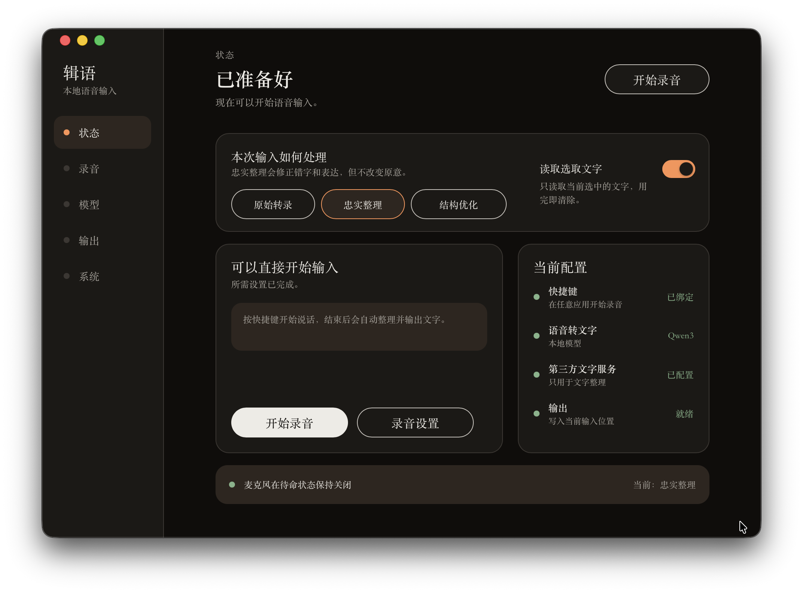

# 辑语 RemTene



> Accelerate typing with your voice; without changing your original meaning in any way, turn flawed spoken expression into clean text with clear logic and readable formatting.

```math
Rem tene, verba sequentur.
Grasp the meaning, and the words will follow.
```

---

RemTene (辑语) is a source-available, cross-application, system-wide voice input tool. Audio is processed locally using ASR (automatic speech recognition). Users can choose to send the resulting text to a self-configured OpenAI-compatible service for faithful cleanup and structural refinement, after which the cleaned text is delivered back to the original input position. <u>The entire process takes no more than three seconds.</u>

Unlike closed-source software with word-count limits and in-app purchases, this software lets you choose your own speech recognition model and freely use third-party services with your own API key. You retain full control over where your data goes.

## Product Features

- **Raw transcription**: Uses only a local speech model to recognize your speech, transcribes your words exactly as spoken, and inserts the text at the cursor you specify.
- **Faithful cleanup**: After you configure a third-party service, RemTene sends the locally transcribed text to the model provider you selected. The LLM and RemTene jointly ensure that the cleaned text remains 100% faithful to your original meaning while correcting all human expression issues and speech imperfections. This ensures that facts, positions, conditions, causal relationships, and logical relationships are expressed correctly.
- **Selected text**: You can select any selectable passage and send it to the LLM as context. You can then issue commands such as translating, querying, or drafting a reply. The LLM processes the selected text according to your instruction.
- **Local ASR**: Qwen and Whisper both process audio locally. This means that your original audio never leaves your computer and is automatically deleted after every processing session, leaving no recording traces.
- **Control panel**: In the control panel, you can configure the recording shortcut, enable launch at startup, and review your previous output history.

## Data and Privacy

- Audio does not leave the local device and is not sent to an LLM, history, or diagnostics.
- The microphone is active only while the user is explicitly recording.
- Raw transcription is entirely local. AI modes send only the text required to complete the task, plus any selected text the user has authorized, to the service configured by the user.
- The API key you configure is currently encrypted locally on the Rust side using AES-256-GCM field-level encryption. The primary key and SQLite ciphertext are stored separately in the application's private directory. The current implementation does not use macOS Keychain or Windows Credential Manager.
- History stores only the final text and creation time, and future history saving can be disabled. History text is not currently encrypted at the application layer.
- Logs, ordinary settings, snapshots, and cross-window events must not store audio, text content, selected text, API keys, or raw Provider content.

## Installation and Model Status

The macOS installer is currently undergoing compliant signing and notarization.

### Currently Supported Speech Recognition Models

- Qwen3 ASR 0.6B
- Whisper large-v3 turbo

> Model download address:

https://huggingface.co/nobodyl/RemTene-ASRModel/tree/main

[`models/README.md`](./models/README.md) records the planned model sources, pinned revisions, hashes, and licenses. This repository retains only legal and provenance materials; download the models from Hugging Face.

## How to Use the Application

After successfully installing the application, open the Models page to see the currently supported models. Click <u>**Open Folder**</u>, download the model you need from <u>[https://huggingface.co/nobodyl/RemTene-ASRModel/tree/main](https://huggingface.co/nobodyl/RemTene-ASRModel/tree/main)</u>, and place it in that folder. Then click **Recheck** to make the model available for use.

---

## Development Environment and Setup

> The following instructions are for developers who want to read, modify, or compile the source code themselves. They are not the installation process for regular end users. Unless otherwise stated, run all commands from the repository root.

### Platforms and Toolchain

The currently verified primary development environment is macOS arm64. These versions form a reproducible baseline; they are not confirmed minimum requirements.

| Tool | Current baseline | Notes |
|---|---:|---|
| Node.js | `24.15.0` | Used by CI and the current development machine |
| pnpm | `11.9.0` | Pinned by the root `package.json` |
| Rust | `1.97.1` | Pinned by `rust-toolchain.toml`, including rustfmt and Clippy |
| Tauri CLI | `2.11.4` | Locked by the Workspace; a global Cargo installation of the CLI is not required |
| CMake | Currently verified with `4.1.0` | Required only when building the macOS ASR Helper with the Whisper Runtime |

macOS desktop development requires at least the Apple Command Line Tools:

```bash
xcode-select --install
```

~~On Windows, follow the [Tauri 2 system prerequisites](https://v2.tauri.app/start/prerequisites/) to install Microsoft C++ Build Tools (select `Desktop development with C++`) and Microsoft Edge WebView2. Windows can currently be used only for shared-code and compilation checks. Recording, the ASR Runtime, target detection, and delivery still contain placeholder implementations and must not be treated as a usable product. Linux does not yet have product support or verification evidence.~~

> Windows is currently under development. Thank you for your patience.

### Get the Source and Install Dependencies

To obtain the source from the public repository:

```bash
git clone https://github.com/TheLearnerL/RemTene-Public.git
cd RemTene-Public
```

Install the same pnpm and Rust toolchain versions used by CI, then restore the locked dependencies:

```bash
npm install --global pnpm@11.9.0

rustup toolchain install 1.97.1 \
  --profile default \
  --component rustfmt,clippy

pnpm install --frozen-lockfile
cargo +1.97.1 fetch --locked
```

Both `pnpm install --frozen-lockfile` and `cargo fetch --locked` require network access to download dependencies the first time. The application does not require a globally installed Tauri CLI on the development machine. Do not delete or bypass `pnpm-lock.yaml`, `Cargo.lock`, or `rust-toolchain.toml`; otherwise, the build will no longer match the currently verified baseline.

## Start Development and Run Validation

Start the Tauri development application:

```bash
pnpm dev
```

This command is suitable for control-panel, Rust IPC, and ordinary application-logic development. A normal `tauri dev` run does not create a complete test bundle with the nested ASR Helper, so a successfully opened window does not mean that local speech recognition is ready to use.

Before submitting code or deciding that the source compiles, run the following commands in order:

```bash
cargo +1.97.1 fmt --all -- --check
pnpm check
pnpm lint
pnpm test
```

On macOS, also check the Whisper Runtime build. This step requires CMake:

```bash
cargo +1.97.1 check \
  -p remtene-asr-worker \
  --all-targets \
  --features whisper-runtime
```

The default tests do not run ignored tests that require a real microphone, Accessibility permission, an official App Group, or real model weights. Passing type checks, linting, mocks, and ordinary automation does not replace validation with real-device recording, real models, cross-application delivery, or a clean installation.

## Builds and Artifacts

Choose the command that matches your goal. Do not describe every artifact as a “release package.”

| Goal | Command | Artifact and boundary |
|---|---|---|
| Frontend production build | `pnpm --filter @remtene/desktop build` | Outputs `apps/desktop/dist/`; does not include the Rust desktop application |
| Tauri Release build | `pnpm --filter @remtene/desktop tauri build --no-bundle` | Outputs `target/release/remtene-desktop`; proves only that the frontend, Rust code, and desktop linking succeed, and does not include an installer or the complete ASR Helper |
| Local macOS test `.app` | `REMTENE_RUST_TOOLCHAIN=1.97.1 pnpm build:macos-helper-dev` | Outputs `target/release/bundle/macos/辑语.app` with an ad-hoc-signed `RemTeneASRWorker.app` embedded; intended only for local development testing |

The macOS Helper build uses Cargo offline mode internally, so a clean environment should first run the earlier `cargo +1.97.1 fetch --locked` command. The root `pnpm build` command requests a complete Tauri Bundle. The DMG, Developer ID, notarization, and formal release pipeline are not yet complete, so this is not the recommended entry point for development builds.

## What Must Be Configured After Compiling

A successful build proves only that the source code and toolchain can produce the target artifact. To complete the “record → local transcription → cleanup → insertion” flow, complete each of the following steps.

1. **Confirm that you are using the correct artifact**

   The bare executable produced by `tauri build --no-bundle` does not contain the complete ASR Helper. For local speech testing on macOS, use the `辑语.app` produced by `pnpm build:macos-helper-dev`. This application is still not a signed release suitable for public distribution.

2. **Install a local model package that passes integrity verification**

   The source repository's `models/` directory contains only provenance and license information; it is not the model directory read by the application. After starting the application, click **Open Folder** on the Models page, place a complete model package—including its weights and adjacent Manifest—in the actual model directory for the current build, and then click **Recheck**. Do not copy only a single weight file, delete the Manifest, or place the model in the repository's `models/` documentation directory. See [`models/README.md`](./models/README.md) for the exact files, pinned revisions, and SHA-256 hashes. The current public source does not yet provide one-click model download or an installer; ASR clearly reports that it is unavailable when no model is installed.

3. **Grant macOS system permissions**

   From the application's System page, open macOS **Privacy & Security** settings and allow microphone access. If you need global shortcuts, target detection, and precise insertion, also grant Accessibility permission. Return to the application and click **Recheck**. macOS may request permission again after the application is re-signed, moved to a different path, or assigned a different Bundle identity.

4. **Configure the recording mode and global shortcut**

   On the Recording page, choose push-to-talk or toggle recording, then enter a shortcut that is not already used by the operating system or another application. You can still test from the control panel without a shortcut, but you will not have the normal cross-application input flow.

5. **Choose the text-processing mode**

   Raw transcription uses local ASR only and does not require a third-party service. Faithful cleanup and structural refinement require an OpenAI-compatible Base URL, model name, and API key under **Models → Text Service**. Save the settings, then run the connection test. API keys must not be placed in source code, environment examples, logs, or commits.

6. **Check output settings**

   Precise insertion depends on an accessible target text control and Accessibility permission. Enable compatibility paste only if you explicitly accept the target application's native paste semantics. If the application cannot prove that insertion succeeded, it retains the temporary text or a failure state instead of automatically inserting the text again.

7. **Distinguish local testing from public distribution**

   Ad-hoc and Apple Development builds are suitable only for local use or testing by informed participants. Distribution to other Macs still requires Developer ID Application signing, notarization, Gatekeeper validation, controlled model delivery, and clean-machine installation testing. This work is not yet complete, so the development `.app` must not be described as a formal release.

A formal end-user release must not require users to install Node.js, Rust, Python, CMake, build tools, or manually manage model files. These are prerequisites for the current source-development and release-engineering workflow, not the intended final product experience.

## Public Source Layout

```text
apps/desktop/                React/TypeScript control panel and Tauri desktop assembly
crates/remtene-domain/       Product state and invariants
crates/remtene-application/  Workflows and Ports
crates/remtene-contracts/    Cross-boundary IPC/Worker contracts
crates/remtene-adapters/     ASR, LLM, settings, history, and secret adapters
crates/remtene-platform/     macOS/Windows platform adapters
crates/remtene-asr-worker/   Independent local ASR Worker
models/                      Model provenance and licenses; does not include weights
scripts/                     Public build and repository self-check scripts
```

To preserve existing users' system permissions, API keys, and model directories, some Bundle IDs, App Groups, and ciphertext formats still retain the historical `bard` identifier as a compatibility ABI (legacy persistent compatibility interface). These are not current product names and must not be renamed casually.

## License, Commercial Licensing, and Third-Party Content

This project is licensed under the [PolyForm Noncommercial License 1.0.0](./LICENSE), which is not an OSI-approved open-source license. Noncommercial use must comply with the official license terms. Commercial use requires separate written authorization; see [Commercial Licensing](./COMMERCIAL_LICENSE.md).

- Project license: [LICENSE](./LICENSE)
- Commercial licensing: [COMMERCIAL_LICENSE.md](./COMMERCIAL_LICENSE.md)
- Third-party notices: [THIRD_PARTY_NOTICES](./THIRD_PARTY_NOTICES)
- Model licenses: [models/LICENSES/](./models/LICENSES/)
- Security issue reporting: [SECURITY.md](./SECURITY.md)
- Contribution guidelines: [CONTRIBUTING.md](./CONTRIBUTING.md)

The project license covers only content that the copyright holder has the right to license. It does not automatically cover third-party dependencies, models, model weights, Runtimes, fonts, icons, assets, datasets, or external API services.
